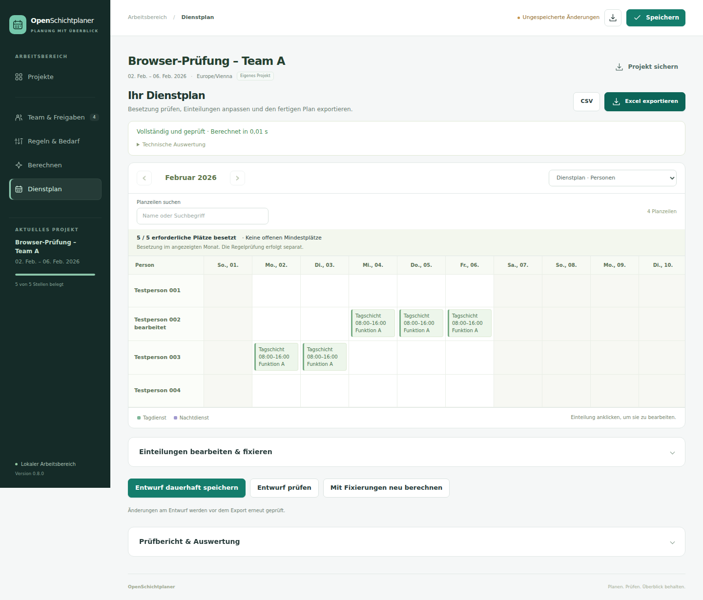

# OpenSchichtplaner5 Generator

Dienstpläne erstellen, gemeinsam geltende Regeln festlegen, Freigaben verwalten und geprüfte Ergebnisse exportieren. Die Anwendung läuft auf dem eigenen Rechner oder Server und berechnet Pläne lokal.

**Version 0.9.7** prüft die Ergebniszuordnung bei CLI-Validierung und synthetischer Testübernahme anhand von Snapshot-ID und Inhaltshash. Die Excel-Korrekturen aus 0.9.6 sind enthalten. Persönliche Dienstfreigaben bleiben der SP5-Standard; zusätzliche Qualifikationsanforderungen sind optional. [Änderungen und Aktualisierung](docs/release-0.9.7.md).



## Start mit Docker

Nach dem Klonen oder Entpacken im Projektverzeichnis:

```sh
docker compose pull
docker compose up -d
```

Im Browser [http://127.0.0.1:8080](http://127.0.0.1:8080) öffnen. Compose verwendet das veröffentlichte Linux-amd64-Image und ein dauerhaftes Zustandsvolume.

1. **Neues Projekt** wählen und Zeitraum, Personen, Funktionen und wiederkehrende Schichten anlegen.
2. Unter **Team & Freigaben** festlegen, wer welche Funktion übernehmen darf. Dienstwünsche, Arbeitszeit und Verfügbarkeit bearbeiten.
3. Unter **Regeln & Bedarf** Besetzung und Ruheprofile prüfen und bestätigen.
4. **Berechnen** starten. Die Berechnung läuft im Hintergrund weiter, wenn der Browser geschlossen wird.
5. Im **Dienstplan** das Ergebnis ansehen, Einteilungen bei Bedarf ändern oder fixieren, erneut prüfen und als Excel, CSV oder JSON exportieren.

Zum Kennenlernen gibt es ein ausschließlich synthetisches Demoprojekt. Für eigene Projekte ist kein SP5-Bestand erforderlich. Vorhandene Projektdateien und SP5-Daten lassen sich über **Vorhandene Daten importieren** laden.

## Arbeitsbereiche

- **Projekte:** gespeicherte Projekte und Berechnungen wieder öffnen, eigene Projekte anlegen und vorhandene Daten importieren.
- **Team & Freigaben:** Personenmatrix mit Suche und vertauschbaren Achsen; persönliche Vorgaben und zeitlich begrenzte Freigaben bearbeiten.
- **Regeln & Bedarf:** Schichten, Funktionen, Besetzungsbedarf, Ruheprofile und Optimierungswünsche verwalten. Ungeklärte Angaben bleiben sichtbar.
- **Berechnen:** Vollplanung oder ausdrücklich gekennzeichnete Teilplanung, begrenzte Rechenzeit und Abbruch laufender Aufträge.
- **Dienstplan:** Monatsansicht nach Personen oder Funktionen, manuelle Einteilungen, Fixierungen, unabhängige Prüfung und Exporte.

Größere Listen werden seitenweise dargestellt. Ausgeblendete Detailtabellen entstehen erst beim Öffnen. Die Monatsansicht zeigt pro Seite bis zu 30 Zeilen; die Einteilungsliste bis zu 40. Das vollständige Projekt bleibt erhalten und wird vollständig berechnet und exportiert.

Gespeicherte Projekte und Ergebnisse liegen im Zustandsverzeichnis. Eine Projektsicherung enthält den aktuellen Entwurf einschließlich Regeln und Fixierungen und kann wieder eingelesen werden. Ungespeicherte Änderungen werden beim Projektwechsel nicht stillschweigend verworfen.

## Installation mit Python

Geprüfter Referenzbetrieb: Linux mit Python 3.12. Im Projektverzeichnis:

```sh
python3.12 -m venv .venv
. .venv/bin/activate
python -m pip install -c requirements-web.lock '.[web,sp5]'
python -m pip check
sp5-generator --version
sp5-generator serve --host 127.0.0.1 --port 8080 --state-dir ./generator-state
```

Alternativ das Wheel aus dem Workflow-Artefakt `openschichtplaner5-generator-python` installieren:

```sh
python -m pip install './openschichtplaner5_generator-0.9.6-py3-none-any.whl[web,sp5]'
sp5-generator serve --host 127.0.0.1 --port 8080 --state-dir ./generator-state
```

Das Extra `web` ergänzt die Oberfläche, `sp5` den DBF-Adapter. Für JSON-Planung über die CLI genügt die Installation ohne Extras. Der HTTP-Dienst startet seinen Berechnungsworker selbst; ein separates Frontend ist nicht nötig. Native Windows-Ausführung wird nicht unterstützt, da Worker und Dateisperren POSIX-Funktionen verwenden.

## Planung über die CLI

```sh
sp5-generator demo -o /tmp/example.json
sp5-generator solve /tmp/example.json --time-limit 30 -o /tmp/result.json
sp5-generator validate /tmp/example.json /tmp/result.json
sp5-generator export /tmp/example.json /tmp/result.json /tmp/result.xlsx
sp5-generator export /tmp/example.json /tmp/result.json /tmp/result.csv
sp5-generator schema input -o /tmp/input.schema.json
sp5-generator schema result -o /tmp/result.schema.json
```

Die synthetische Demo enthält unterschiedliche Beschäftigungsausmaße, Tag- und Nachtdienste, zeitlich begrenzte Verfügbarkeit, wechselnde Wochen, eine Abwesenheit und eine Fixierung. Kontext außerhalb des Beispiels ist ausdrücklich dienstfrei.

`solve --partial` erlaubt einen gekennzeichneten Teilplan. Exitcodes: `0` vollständiger geprüfter Plan oder erfolgreicher Export; `2` ungültige Eingabe oder Modell; `3` Teilplan oder unvollständige beziehungsweise fehlgeschlagene Prüfung; `4` bewiesen unlösbar; `5` noch keine Lösung. `FEASIBLE` bedeutet, dass eine gültige Lösung gefunden wurde, ohne deren Optimalität zu beweisen. Der genaue Solverstatus steht im Ergebnis.

## SP5 und Betrieb

**Die SP5-Anbindung liest Stammdaten und Historie. Direktes Zurückschreiben in originale SP5-Dienstpläne ist nicht implementiert.** Historische Einteilungen erzeugen unbestätigte Freigabevorschläge; sie ersetzen keine Qualifikationsnachweise. Ungeklärte Originalsemantik bleibt als blockierende Diagnose erhalten.

Die Anwendung ist für eine lokale Planungsinstanz mit optionalem gemeinsamem Passwort vorgesehen. Getrennte Benutzerkonten und Mandanten sind nicht enthalten. Regelprofile müssen zum jeweiligen Einsatz passen; bestandene technische Prüfungen bestätigen keine Rechtskonformität frei gewählter Regeln.

- [Webbetrieb, Zugriffsschutz und Updates](docs/web-operation.md)
- [Docker, Quellverzeichnis und Offline-Image](docs/container.md)
- [Bedienung und Import](docs/standalone-web.md)
- [SP5-API konfigurieren](docs/api-source.md)
- [Matrix und Monatsplan](docs/matrix-and-monthly-plan.md)

## Entwicklung und Prüfung

```sh
python -m pip install -c requirements-web.lock '.[dev,web,sp5]'
python -m pip check
python -m pytest -q
python -m build
python tools/check_distribution.py
npm ci --prefix tests/browser
npm exec --prefix tests/browser -- playwright install --with-deps chromium
npm test --prefix tests/browser
```

Der Container-Workflow prüft Python, Browser, saubere Paketinstallationen, den echten Hintergrundworker und Berechnung ohne Netzwerk, bevor er Images auf `main` veröffentlicht. Für reproduzierbare Installationen den Commit-Tag `sha-…` oder den Image-Digest festhalten.

- [Prüfungen und gemessene Laufzeiten](docs/verification.md)
- [Release 0.8.0 und Aktualisierung](docs/release-0.8.0.md)
- [Regeln, Zeitberechnung und Zielfunktion](docs/rules.md)
- [Architektur und Integration](docs/architecture.md)
- [SP5-Zuordnung und offene Semantik](docs/sp5-mapping.md)
- [Jobs und Datenhaltung](docs/operations.md)

Die optionale Integration in das Schwesterprojekt hat einen eigenen Abnahmeumfang und ist für diese eigenständige Anwendung nicht erforderlich. Aktivierung und synthetischer Integrationsbetrieb sind in der [Betriebsdokumentation](docs/operations.md) beschrieben.

Beim SP5-Import sind zusätzliche Qualifikationsnachweise standardmäßig deaktiviert; persönliche Dienstfreigaben bleiben erforderlich. Bei Bedarf können zusätzliche Qualifikationsanforderungen pro Position aktiviert werden. Bestehende Projektsicherungen werden nicht automatisch verändert.
